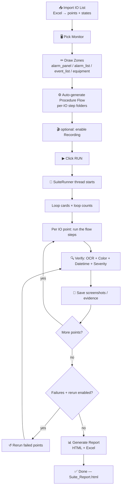
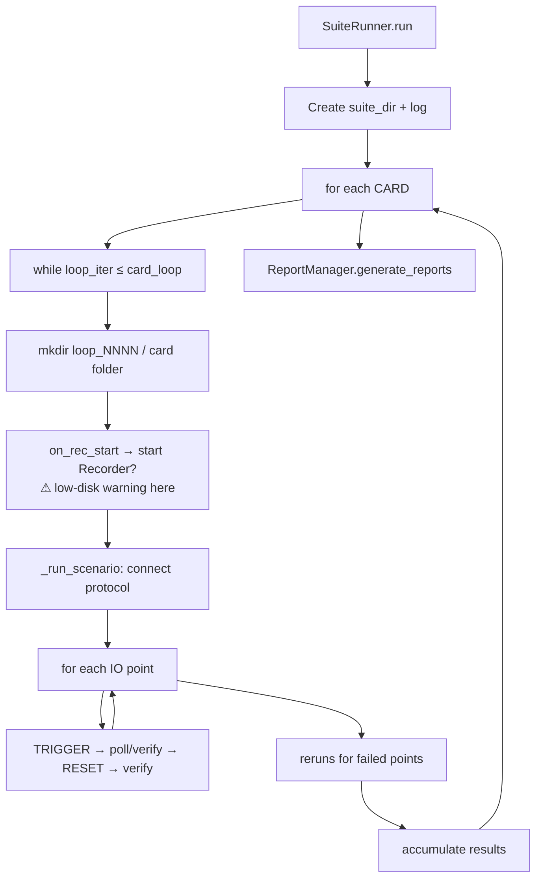

# ISCS AutoClick — Suite Runner Process Flow

End-to-end flow of a Suite run: **IO List → Zones → Procedure Flow → Run → Verify → Evidence → Report.**

> Tip: open this in a Markdown previewer (VS Code: `Ctrl+Shift+V`) to see the diagrams rendered.

---

## 1. The Big Picture



---

## 2. Stage-by-Stage

### Stage 1 — Import the IO List  (the "what to test")
- **Where:** Excel import → `_excel_file_loaded()` (`baru.py:6644`), stored on the card as `sc.iscs_points` (`baru.py:6738`).
- Each row → one **point** with a `point_id`, `equipment_description`, `attribute_description`, Modbus/SNMP address, and a **states** table.
- **States** are parsed by `_find_state_table_cols()` / `_extract_states()` (`baru.py:427/448`):
  - `v0` = **Normal / reset** state (e.g. NORMAL, severity 0, green)
  - `v1` = **Alarm / trigger** state (e.g. ALARM, severity 1, red)
- `_get_state_indices()` (`baru.py:466`) derives trigger vs reset index purely from the states — no hardcoding.

### Stage 2 — Pick Monitor & Draw Zones  (the "where to look")
- Card stores `monitor_info` + `zones_per_page` (rectangles in pixel coords).
- Zone types: `alarm_panel`, `alarm_list`, `event_list`, `equipment_page`.
- Optional **anchors** (`iscs_Sampler_Anchor.py`) re-resolve a zone's bbox at runtime if the SCADA layout shifts.

### Stage 3 — Procedure Flow  (the "how to test")
- `auto_register_procedures()` (`iscs_workflow.py:624`) inspects zones + IO list and builds a default flow:
  - IO list → `Trigger Alarm` + `Reset Alarm`
  - `alarm_panel` zone → `Verify Alarm Panel` + `Verify Normalize`
  - `alarm_list` / `event_list` / `equipment` zones (+ nav coords) → matching navigate + verify steps
- **Each IO point gets its own folder** (`IOGroup`) holding a full copy of the steps, so one point can be customized without touching the others.
- Editable in the Flow Editor (`ProcedureFlowDialog`). Custom asset-bound steps (`VERIFY_CUSTOM`) can verify any screen element via Text/Image/Region bindings.

### Stage 4 — Click RUN  (the orchestration)
`_run_suite()` (`baru.py:4036`) builds a **`SuiteRunner`** (a background `threading.Thread`, `baru.py:1889`) and starts it.



- **Loops:** every card can repeat (`card_loop`, or infinite). Each iteration = a `loop_NNNN/` folder.
- **Per point** (`_run_scenario`, `baru.py:2264`): connect the Modbus/SNMP handler, then for each point run its flow steps.

### Stage 5 — Verification Engine  (per point)
For the alarm panel (`verify_alarm_panel`, `baru.py:~1103`):
1. **Trigger** the alarm via protocol; record `trigger_ns` (exact send time).
2. **Poll loop** for up to `detection_duration_sec`: grab the zone, run OCR (`iscs_OCR.run`), exit early when the expected ID + value appear.
3. Evaluate, in the same window:
   - **OCR text** → identifier, description, value (`_ocr_contains` / `_ocr_fuzzy_contains`)
   - **Severity** → word-boundary match, with a digit-cell fallback (`iscs_OCR.run_digits`) for the isolated `0`/`1`
   - **Color + blink** → sampler frames checked against expected RGB (red alarm / green normal)
   - **Datetime** → SCADA on-screen clock vs trigger time, within `datetime_sync_limit_sec`
4. **Reset** the alarm and verify it normalizes (everything clears).
5. Repeat for alarm_list / event_list / equipment if those zones/steps exist.

### Stage 6 — Evidence & Recording
- Per-check **screenshots** saved as `..._PASS.png` / `..._FAIL.png`.
- On failure, a **diagnostics bundle** is written (cropped zones + OCR text + Modbus context + `expected_vs_actual_comparison.json`).
- Optional **screen recording** (`iscs_recorder.py`): per-card MP4 with timestamp/point overlay, hourly auto-split. The low-disk pre-flight warning is shown here.

### Stage 7 — Rerun (optional)
- After a card's points run, failed points can be retried `N` times or **until pass** (`rerun_failed_count`).
- A rerun re-runs only the failed `point_id`s (`baru.py:2033`).
- **Every attempt is preserved** in the report (Attempt 0 FAIL → Attempt 1 PASS…).

### Stage 8 — Report
- At the end, `ReportManager.generate_reports()` (`iscs_reports.py`, called `baru.py:2063`):
  - `normalize_results()` consolidates loops + scenarios + all rerun attempts per point.
  - Writes **`Suite_Report.html`** (overall pass rate, loop→card tree, per-point step trace, **Execution History (all attempts)**, evidence file tree) and a multi-sheet **Excel** workbook.

---

## 3. Output Folder Layout

```
test_logs/
└── <title>_suite_<timestamp>/
    ├── Suite_Report.html          ← the consolidated report
    ├── <suite>.xlsx               ← Excel export
    ├── test_run.log
    └── loop_0001/
        └── 1_<CardName>/
            ├── 0000_<point>_alarm_panel_trigger_PASS.png
            ├── 0000_<point>_alarm_panel_normalize_FAIL.png
            ├── <CardName>_<ts>.mp4         ← recording (if enabled)
            └── failures/
                └── 0000_<point>_<ts>/
                    ├── crop_zone_alarm_panel_trigger.png
                    ├── crop_zone_alarm_panel_normalize.png
                    ├── expected_vs_actual_comparison.json
                    ├── alarm_metadata.json
                    └── timestamp_delta.json
```

---

## 4. Module Map (who does what)

| Concern | File / Function |
|---|---|
| Main UI, cards, Suite orchestration | `baru.py` — `SuitePanel`, `SuiteRunner` |
| Run loop (thread) | `baru.py:1960` `SuiteRunner.run()` |
| Per-card / per-point execution | `baru.py:~2120` `_run_scenario()` |
| Alarm-panel verification | `baru.py:~1103` `verify_alarm_panel()` |
| Procedure Flow engine | `iscs_workflow.py` — `ProcedureFlow`, `ProcedureRunner`, `auto_register_procedures` |
| OCR engine | `iscs_OCR.py` — `run()`, `run_digits()`, `preprocess()` |
| Zone anchoring | `iscs_Sampler_Anchor.py` |
| Reusable verify assets | `iscs_assets.py` — text/image/region bindings |
| Screen recording | `iscs_recorder.py` |
| Reports (HTML + Excel) | `iscs_reports.py` — `ReportManager`, `normalize_results` |

---

## 5. Key Settings That Affect a Run
(Settings & Configuration window → grouped sections)

| Setting | Effect |
|---|---|
| `detection_duration_sec` | How long to poll for the alarm to appear + observe color/blink |
| `datetime_sync_limit_sec` | Max allowed gap between SCADA clock and trigger time before datetime FAILs |
| `nav_wait_sec` | Pause between navigation clicks |
| `sampler_interval_ms` | Frame-grab rate for color/blink detection |
| Recording FPS / disk warn threshold | Recording quality + pre-flight disk check |

---

## TL;DR one-liner
> **Import IO list → draw zones → auto-build a per-point Procedure Flow → SuiteRunner loops every point (trigger ▶ OCR/color/time verify ▶ reset ▶ verify) capturing screenshots/video → reruns failures → emits one consolidated `Suite_Report.html` + Excel.**
